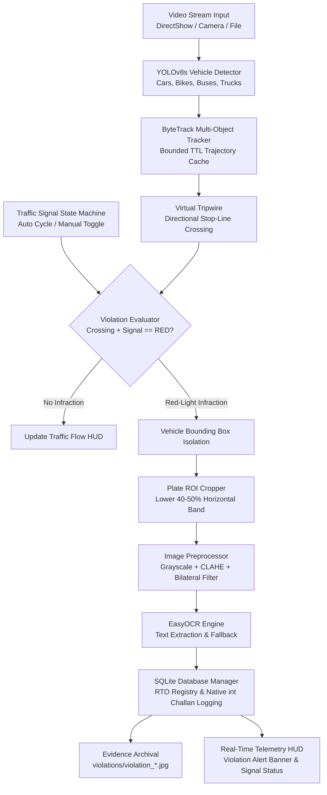

# TRAFFIQ: AI-Powered Traffic Monitoring & Automated E-Challan System

[](https://www.python.org/)
[](https://developer.nvidia.com/cuda-toolkit)
[](https://github.com/ultralytics/ultralytics)
[](https://github.com/ifzhang/ByteTrack)
[](https://github.com/JaidedAI/EasyOCR)
[](LICENSE)
[](tests/)

**TRAFFIQ** is an end-to-end intelligent transportation and automated enforcement system designed to detect roadway traffic in real time, track vehicle trajectories across calibrated virtual tripwires, monitor traffic signal compliance, identify stop-line red-light infractions, isolate and preprocess license plate regions of interest (ROI), extract vehicle plate numbers via optical character recognition (OCR), and automatically issue e-challans backed by an RTO database registry.

---

## Table of Contents
1. [Key Features](#key-features)
2. [System Architecture](#system-architecture)
3. [Hardware Requirements & Acceleration](#hardware-requirements--acceleration)
4. [Installation & Setup](#installation--setup)
5. [Operational Modes & CLI Usage](#operational-modes--cli-usage)
6. [Code Knowledge Graph (Graphifyy)](#code-knowledge-graph-graphifyy)
7. [Testing & Verification Guide](#testing--verification-guide)
8. [Repository Structure](#repository-structure)
9. [Contributing & License](#contributing--license)

---

## Key Features

- **Multi-Class Vehicle Detection**: Accelerated inference via YOLOv8s targeting Cars, Motorcycles, Buses, Trucks, and Bicycles with customizable confidence thresholds.
- **Persistent Multi-Object Tracking**: ByteTrack integration maintaining consistent vehicle tracking IDs across frames with a bounded time-to-live (TTL) trajectory cache preventing memory leaks.
- **Virtual Tripwire & Flow Analytics**: Direction-aware centroid tracking across a calibrated stop-line with live throughput and vehicle density telemetry.
- **Traffic Signal State Management**: Automated cycle simulation (Red/Green phases) synchronized with live countdowns and real-time manual keyboard overrides.
- **Red-Light Violation Enforcement**: Immediate stop-line infraction detection when a vehicle crosses the virtual tripwire during a RED signal phase.
- **Dedicated License Plate ROI Isolation**: Isolates the lower 40–50% horizontal band of detected vehicle bounding boxes to maximize OCR precision and eliminate vehicle body noise.
- **Advanced Plate Preprocessing**: Contrast-Limited Adaptive Histogram Equalization (CLAHE) combined with bilateral edge-preserving filtering prior to character extraction.
- **Robust OCR with Graceful Fallback**: Optical character recognition powered by EasyOCR with deterministic fallback to `("UNKNOWN", 0.0)` on unreadable or degraded crops.
- **Integrated RTO E-Challan Registry**: Queries RTO vehicle registration records in SQLite (`traffiq_enforcement.db`), enforces strict native integer serialization (`int`), and logs timestamped infractions.
- **On-Screen HUD & Evidence Archival**: Real-time Heads-Up Display (HUD) displaying violation banner alerts, signal phase indicator, and timestamped JPEG evidence captures in `violations/`.

---

## System Architecture

### Architectural Dataflow (Mermaid)



### Architectural Pipeline (ASCII)

```
 +-------------------------------------------------------------------------+
 |                            VIDEO STREAM INPUT                           |
 |         (DirectShow cv2.CAP_DSHOW on Windows / Webcam / Video File)      |
 +------------------------------------+------------------------------------+
                                      |
                                      v
 +-------------------------------------------------------------------------+
 |                     YOLOv8s VEHICLE DETECTION ENGINE                    |
 |          Classifies & locates: Car, Motorcycle, Bus, Truck, Bicycle     |
 +------------------------------------+------------------------------------+
                                      |
                                      v
 +-------------------------------------------------------------------------+
 |                     BYTETRACK MULTI-OBJECT TRACKER                      |
 |    Associates detections into persistent Track IDs with TTL memory cache|
 +------------------------------------+------------------------------------+
                                      |
                                      v
 +-------------------------------------------------------------------------+
 |                       VIRTUAL STOP-LINE TRIPWIRE                        |
 |    Calculates centroid trajectory vectors and directional line crossing |
 +------------------+----------------------------------+-------------------+
                    |                                  |
                    v                                  v
 +------------------------------------+  +---------------------------------+
 |    TRAFFIC SIGNAL CONTROLLER       |  |       TRAFFIC FLOW TELEMETRY    |
 |    State Machine: RED / GREEN      |  |   Throughput & Density Metrics  |
 +------------------+-----------------+  +---------------------------------+
                    |
                    v
 +-------------------------------------------------------------------------+
 |                     RED-LIGHT VIOLATION EVALUATOR                       |
 |    Determines if stop-line crossing occurred during RED signal phase    |
 +------------------------------------+------------------------------------+
                                      |
                                      v
 +-------------------------------------------------------------------------+
 |                     LICENSE PLATE ROI EXTRACTION                        |
 |       Isolates lower 40-50% horizontal band of vehicle bounding box     |
 +------------------------------------+------------------------------------+
                                      |
                                      v
 +-------------------------------------------------------------------------+
 |                     IMAGE PREPROCESSING PIPELINE                        |
 |         Grayscale Conversion -> CLAHE Equalization -> Bilateral Filter  |
 +------------------------------------+------------------------------------+
                                      |
                                      v
 +-------------------------------------------------------------------------+
 |                          EASYOCR ENGINE                                 |
 |    Extracts license plate alphanumeric characters (Fallback: 'UNKNOWN') |
 +------------------------------------+------------------------------------+
                                      |
                                      v
 +-------------------------------------------------------------------------+
 |                     SQLITE E-CHALLAN REPOSITORY                         |
 |    RTO Owner Lookup & Challan Insertion (Strict native integer track_id)|
 +------------------+----------------------------------+-------------------+
                    |                                  |
                    v                                  v
 +------------------------------------+  +---------------------------------+
 |         EVIDENCE ARCHIVAL          |  |         TELEMETRY HUD           |
 |    violations/violation_*.jpg      |  | Real-time Alert Banner & Stats  |
 +------------------------------------+  +---------------------------------+
```

---

## Hardware Requirements & Acceleration

TRAFFIQ is optimized for high-performance edge inference while maintaining universal platform compatibility:

| Component | Recommended Specification | Minimum / Fallback |
|---|---|---|
| **GPU** | NVIDIA GeForce RTX 4060 Laptop GPU (8.0 GB VRAM) | CPU inference supported (`--device cpu`) |
| **Compute Platform** | CUDA 12.6 with cuDNN acceleration | Standard PyTorch CPU runtime |
| **Video Backend** | DirectShow (`cv2.CAP_DSHOW`) on Windows | Standard OpenCV VideoCapture backend |
| **Resolution** | 1280x720 (720p) @ 30+ FPS | 640x480 (VGA) |
| **RAM** | 16 GB DDR5 | 8 GB System RAM |
| **Storage** | Fast NVMe SSD for violation evidence snapshots | Standard HDD |

- **DirectShow Acceleration**: On Windows systems, TRAFFIQ initializes cameras using the `cv2.CAP_DSHOW` video capture backend, eliminating driver negotiation delays and enabling instant sub-millisecond hardware capture loops.
- **Bounded Memory Structures**: The vehicle tracking trajectory cache employs a frame-based time-to-live (TTL) eviction policy. Stale tracks are evicted after 30 frames of absence without ever dropping active trajectories.
- **Graceful CPU Fallback**: Passing `--device cpu` or running on hardware without an NVIDIA GPU automatically routes YOLOv8 and EasyOCR inference through PyTorch's optimized CPU kernels.

---

## Installation & Setup

### 1. Clone Repository
```bash
git clone https://github.com/traffiq-org/TRAFFIQ.git
cd TRAFFIQ
```

### 2. Create & Activate Virtual Environment

**Windows (PowerShell):**
```powershell
python -m venv .venv
.\.venv\Scripts\Activate.ps1
```

**Windows (Command Prompt):**
```cmd
python -m venv .venv
.\.venv\Scripts\activate.bat
```

**Linux / macOS:**
```bash
python3 -m venv .venv
source .venv/bin/activate
```

### 3. Install PyTorch with CUDA Support
For NVIDIA GPU acceleration with CUDA 12.6:
```bash
pip install torch torchvision --index-url https://download.pytorch.org/whl/cu126
```
*(For CPU-only machines, simply run `pip install torch torchvision`).*

### 4. Install TRAFFIQ Dependencies & Package
```bash
pip install -r requirements.txt
pip install -e .
```

### 5. Initialize the RTO Database
Seed the SQLite database with vehicle registry data:
```bash
python init_db.py
```

---

## Operational Modes & CLI Usage

TRAFFIQ provides a unified command-line interface via `main.py` (or the installed `traffiq` CLI binary) supporting 4 distinct operational modes:

```bash
python main.py --help
```

### Operational Modes

| Mode | Command | Description |
|---|---|---|
| **`diagnostics`** | `python main.py --mode diagnostics` | Performs preflight hardware, CUDA GPU, camera stream, and database schema/integrity checks. |
| **`detection`** | `python main.py --mode detection` | Runs real-time YOLOv8s vehicle detection with live vehicle density telemetry. |
| **`tracking`** | `python main.py --mode tracking` | Runs ByteTrack multi-object tracking with virtual tripwire vehicle flow counting. |
| **`enforcement`** | `python main.py --mode enforcement` | Executes the full automated enforcement loop: signal cycle, red-light detection, plate ROI OCR, and e-challan issuance. |

### CLI Examples

**1. Run Preflight Diagnostics (Headless):**
```bash
python main.py --mode diagnostics --no-gui
```

**2. Run Real-Time Vehicle Detection:**
```bash
python main.py --mode detection --source 0 --conf 0.30 --device 0
```

**3. Run Multi-Object Tracking on a Video File:**
```bash
python main.py --mode tracking --source sample_traffic.mp4 --line-ratio 0.50
```

**4. Run Full Automated Enforcement:**
```bash
python main.py --mode enforcement --fine 1500 --signal-duration 10.0 --device 0
```

**5. Automated Headless Test Execution:**
```bash
python main.py --mode enforcement --no-gui --max-frames 100
```

### Command-Line Arguments Reference

| Argument | Type | Default | Description |
|---|---|---|---|
| `mode` / `-m`, `--mode` | string | `enforcement` | Operational mode: `diagnostics`, `detection`, `tracking`, `enforcement` (aliases: `diag`, `detect`, `track`, `enforce`). |
| `-s`, `--source`, `--camera` | string/int | `0` | Camera device index (e.g., `0`) or file path to video stream. |
| `--width` | int | `1280` | Capture frame width in pixels. |
| `--height` | int | `720` | Capture frame height in pixels. |
| `--device` | string | `0` | Inference compute device: `'0'` for CUDA GPU or `'cpu'`. |
| `--model` | string | `yolov8s.pt` | Path to YOLO model weights file. |
| `--conf` | float | `0.25` | YOLO detection confidence threshold (`0.0`–`1.0`). |
| `--imgsz` | int | `640` | Inference image input dimension. |
| `--tracker` | string | `bytetrack.yaml`| ByteTrack tracker configuration file. |
| `--line-ratio` | float | `0.55` | Virtual stop-line tripwire vertical position ratio (`0.0`–`1.0`). |
| `--fine` | int | `1000` | Traffic infraction penalty fine amount in INR. |
| `--signal-duration` | float | `8.0` | Traffic light phase duration in seconds. |
| `--output-dir` | string | `violations` | Output folder for timestamped violation evidence snapshots. |
| `--db-path` | string | `traffiq_enforcement.db` | Path to SQLite e-challan database. |
| `--no-gui` | flag | `False` | Disables OpenCV display windows for headless execution. |
| `--max-frames` | int | `None` | Max frames to process before terminating (ideal for automated testing). |

### Interactive Keyboard Controls
When running with GUI windows enabled (`--no-gui` omitted):
- **`t`**: Manually toggle traffic light signal state between **RED** and **GREEN**.
- **`q`**: Gracefully quit application, release camera stream, and close display windows.

---

## Code Knowledge Graph (Graphifyy)

TRAFFIQ integrates [**Graphifyy**](https://github.com/graphifyy/graphifyy) (`graphify`) to generate an interactive, queryable code knowledge graph mapping all module dependencies, function calls, class hierarchies, and dataflow paths across the codebase.

### Commands & Usage

**1. Verify Graphifyy Installation:**
```bash
graphify --version
# or
python -m graphifyy --version
```

**2. Generate / Update Code Knowledge Graph:**
Run `graphify` against the repository root:
```bash
graphify .
```
This indexes the `traffiq/` package and generates graph artifacts inside `graphify-out/`:
- `graphify-out/graph.json`: Machine-readable dependency graph structure.
- `graphify-out/graph.html`: Interactive web-based visualization of code topology.
- `graphify-out/report.md`: Structural complexity and modularity metrics.

**3. Inspecting the Graph:**
Open `graphify-out/graph.html` in any modern web browser to interactively explore module connections, inspect class inheritance, and trace the enforcement pipeline.

**4. Re-indexing Procedure:**
Whenever new modules or methods are added to `traffiq/`, execute `graphify .` to refresh the knowledge graph.

---

## Testing & Verification Guide

TRAFFIQ features a dual-mode test suite combining Pytest, standard library Unittest, and a standalone zero-dependency verification runner.

### 4-Tier Test Suite Architecture

```
tests/
├── conftest.py             # Shared synthetic fixtures & mock frames
├── tier1_unit/             # Tier 1: Pure logic unit tests (0ms, no I/O, no GPU)
│   ├── test_cli_parsing.py
│   ├── test_config.py
│   ├── test_imports.py
│   ├── test_text_cleaning.py
│   └── test_tripwire_math.py
├── tier2_component/        # Tier 2: Component tests (synthetic frames & mocks)
│   ├── test_database_crud.py
│   ├── test_ocr_fallback.py
│   ├── test_plate_preprocessing.py
│   ├── test_plate_roi.py
│   └── test_signal_controller.py
├── tier3_sanitization/     # Tier 3: Database serialization & memory bounds
│   ├── test_db_migration.py
│   ├── test_db_serialization.py
│   ├── test_db_verification.py
│   └── test_memory_bounds.py
└── tier4_e2e_integration/  # Tier 4: End-to-end integration & repo hygiene
    ├── test_cli_execution.py
    ├── test_graphify_cli.py
    └── test_repo_hygiene.py
```

### Running Tests

**Run full test suite via Pytest:**
```bash
pytest tests/ -v
```

**Run via Python's standard Unittest discovery:**
```bash
python -m unittest discover tests
```

**Run individual test tiers:**
```bash
pytest tests/tier1_unit/ -v
pytest tests/tier2_component/ -v
pytest tests/tier3_sanitization/ -v
pytest tests/tier4_e2e_integration/ -v
```

### Standalone Acceptance Verification Runner
To verify all 6 core acceptance criteria without external test framework dependencies:
```bash
python scripts/verify_all.py
```

The script verifies:
1. **Data Sanitization**: 100% of rows in `challan_records` have integer `track_id` values (0 binary blobs).
2. **License Plate OCR**: Dedicated ROI cropping (lower 40–50% band) and `("UNKNOWN", 0.0)` fallback.
3. **Clean Package Architecture**: All 18 modules under `traffiq/` import cleanly.
4. **Unified CLI Launcher**: `python main.py --help` exits with code 0 and displays all operational modes.
5. **Graphifyy Tooling**: `graphify --version` executes cleanly.
6. **Repository & Git Hygiene**: Standard documentation exists and `git status` exposes zero binaries or model weights.

---

## Repository Structure

```
TRAFFIQ/
├── main.py                     # Unified CLI entrypoint
├── pyproject.toml              # PEP 517/621 packaging metadata
├── requirements.txt            # Runtime & development dependencies
├── LICENSE                     # MIT License (2026)
├── CONTRIBUTING.md             # Contributor guidelines & code standards
├── README.md                   # System documentation
├── .gitignore                  # Git hygiene rules
├── check_gpu.py                # Preflight hardware diagnostic script
├── init_db.py                  # RTO database initialization & seeding
├── test_camera.py              # Camera stream diagnostic utility
├── traffiq/                    # Core modular Python package
│   ├── __init__.py             # Package version (__version__ = "1.0.0")
│   ├── config/                 # Centralized configuration dataclass
│   │   ├── __init__.py
│   │   └── settings.py         # TraffiqConfig dataclass & parameter validation
│   ├── database/               # SQLite database & RTO registry
│   │   ├── __init__.py
│   │   ├── connection.py       # SQLite connection manager & numpy int adapter
│   │   ├── repository.py       # RTO lookup & challan logging (native int)
│   │   └── migration.py        # In-place blob-to-int sanitization & verification
│   ├── vision/                 # Computer vision & trajectory tracking
│   │   ├── __init__.py
│   │   ├── camera.py           # Safe CameraStream context manager (try...finally)
│   │   ├── detector.py         # YOLOv8 vehicle detector (CUDA GPU / CPU)
│   │   ├── tracker.py          # ByteTrack wrapper with bounded TTL trajectory cache
│   │   └── tripwire.py         # Virtual counting stop-line & crossing math
│   ├── enforcement/            # Signal, violation, plate OCR & challans
│   │   ├── __init__.py
│   │   ├── signal.py           # TrafficSignal state machine & manual toggle
│   │   ├── violation.py        # Stop-line red-light infraction evaluator
│   │   ├── ocr.py              # Plate ROI isolation, CLAHE preproc & EasyOCR
│   │   └── challan.py          # ChallanIssuer & HUD banner alerts
│   └── cli/                    # CLI dispatcher
│       ├── __init__.py
│       └── app.py              # Argument parser & operational mode dispatchers
├── tests/                      # 4-Tier automated test suite
│   ├── conftest.py             # Shared fixtures & synthetic test frames
│   ├── tier1_unit/             # Unit tests (imports, config, math, parsing)
│   ├── tier2_component/        # Component tests (ROI, preprocessing, signal)
│   ├── tier3_sanitization/     # Database integrity & memory bounds
│   └── tier4_e2e_integration/  # E2E CLI, repository hygiene & graphify tests
├── scripts/
│   └── verify_all.py           # Standalone zero-dependency verification runner
└── graphify-out/               # Generated code knowledge graph outputs
```

---

## Contributing & License

We welcome community contributions! Please review our [**Contributing Guidelines**](CONTRIBUTING.md) for details on our code of conduct, environment setup, coding standards, and pull request workflow.

This project is licensed under the [**MIT License**](LICENSE) &copy; 2026 TRAFFIQ Contributors.
